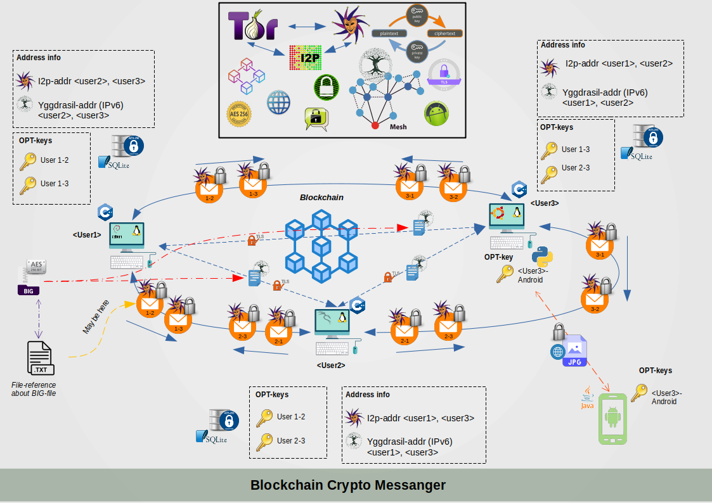
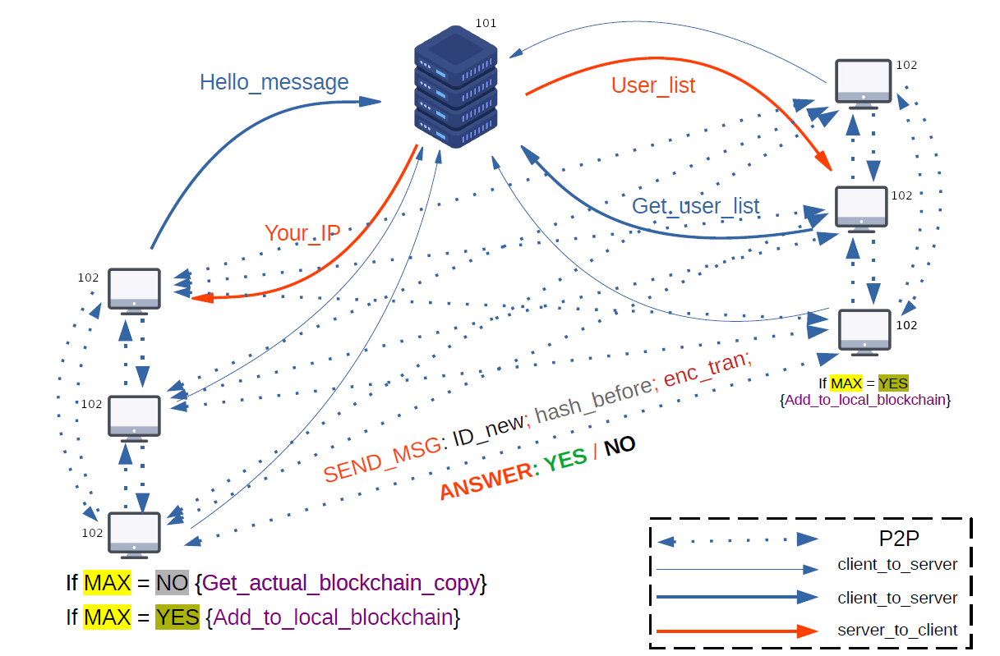
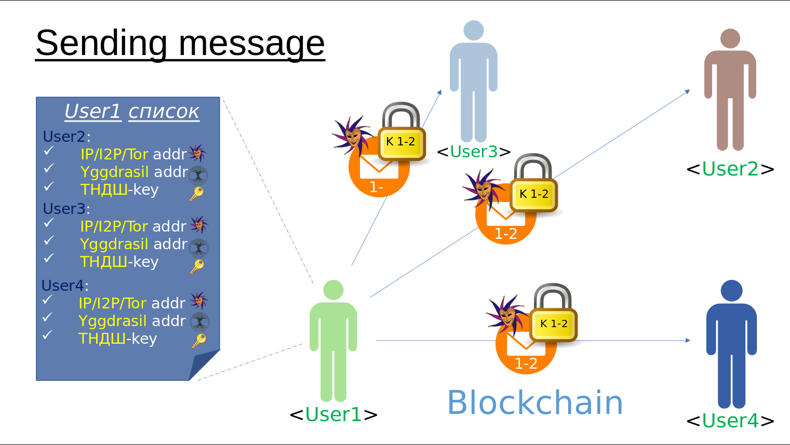
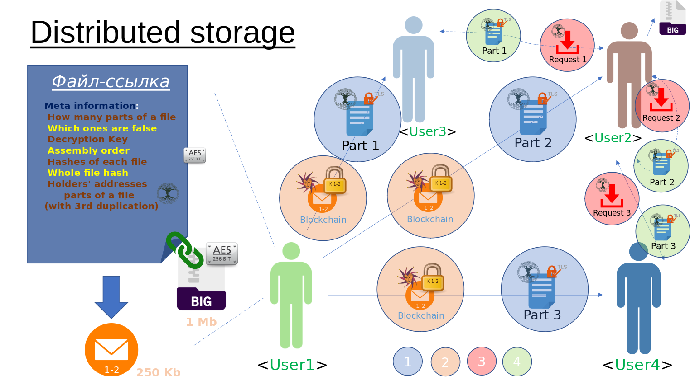
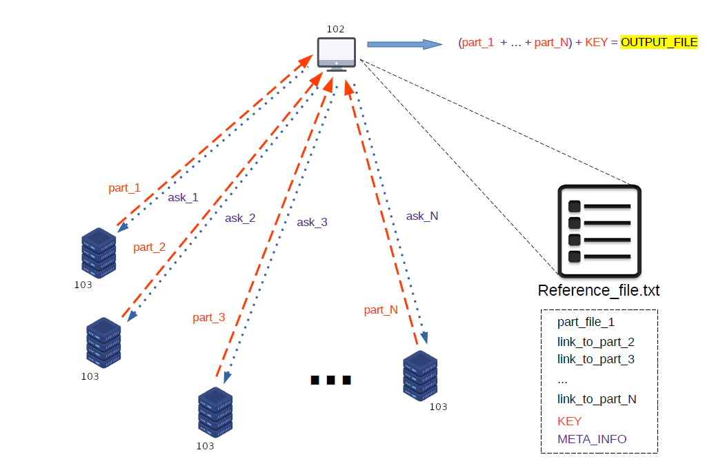
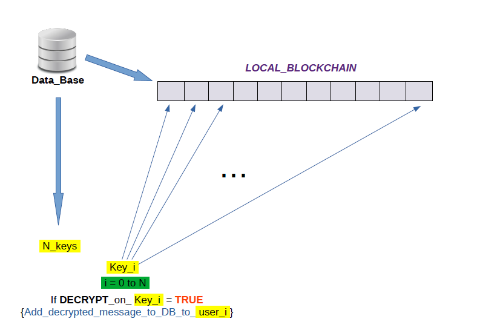
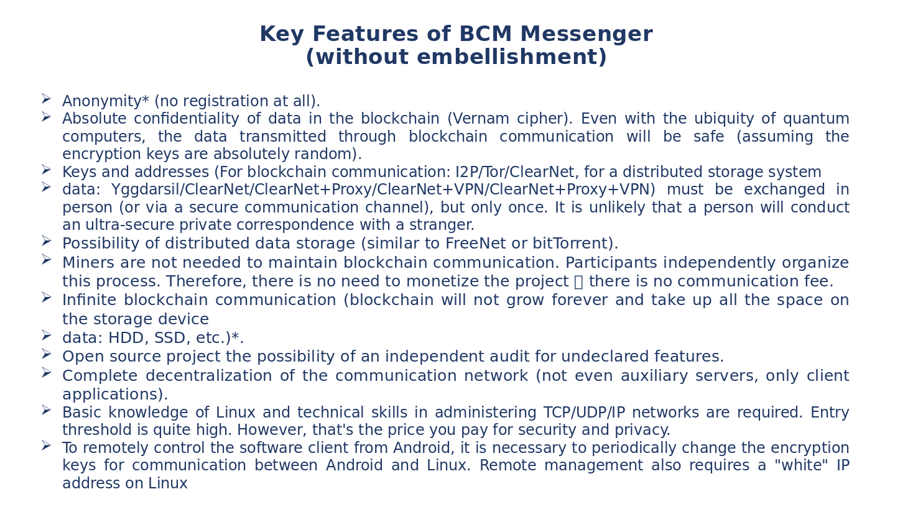
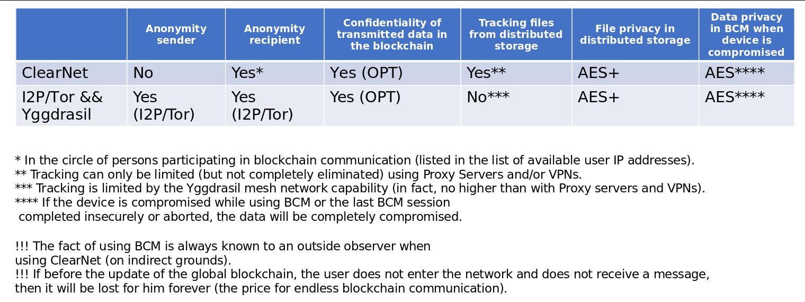

  

<h1 align="center">
  Blockchain Crypto Messanger "Geekon"
</h1>

## Blockchain Crypto Messanger &middot;   [Android Studio](https://img.shields.io/badge/IDE-Android%20Studio-lightgrey)](https://developer.android.com/studio)          ##

This repository contains the code and configuration for deploying and running the `Blockchain Crypto Messanger` project, which is a node of the blockchain network.

The project is composite and includes the following components:
- BCM-Linux-Console (`C`, `C++`, `Python`, `I2Pd`, `Yggdrasil`)
- Android-Client (`Android Studio`, `Java`)

The main features of this messenger are:
- There is no need for miners to make a decision in the consensus process
- Solved the problem* of the ever-growing size of the blockchain (* - it periodically resets when a certain number of transactions is reached)
- Encryption using one-time pads is used (i.e. even quantum computers will not be able to decrypt messages ever entered the blockchain)
- Solved the need for a constant key exchange-one-time pads (only a one-time key exchange is needed) thanks to a distributed data storage system (more details will be described in a future article or read the source code)
- Added implementation of distributed data storage running on top of `Yggdrasil mesh network (SSL + ipv6)`
- Added the ability to put large files in a distributed storage, create small link files on them and send them on the blockchain, and the recipient, if necessary, will be able to request them from the distributed storage
- Added the ability to remotely control the node without losing the level of security (encryption using one-time pads)
- Anonymity in the project is provided by the blockchain network, as well as the `i2p` network.
- All information about the node is concentrated in the `SQLite` database encrypted with `AES-256` and, if necessary, transferring the messenger to another device will not be difficult.
- Added basic protection against `keylogger` when entering a password from the database.

**General functional model** 

  

**Network architecture** 

  

 

At the moment, a decision has been made to abolish the central server, and users who want to communicate must exchange address and key information in person or through a trusted communication channel. 

**Sending message** 

  

**Functioning of distributed storage** 

  

**Reference file structure** 

  

**Checking messages addressed to a user** 

  

**Key features of BCM** 

  

**Security level** 

  

## :desktop_computer: BCM-Linux-Console part of the project ##

This part of the project is its core and is designed to deploy a node in the blockchain network and communicate with other network participants.

Full list of provided functionality:
- Deployment of a blockchain network node participating in the consensus process, in which there is no need for miners and complex calculations
- Providing the console interface of the messenger
- Ability to add users to the messenger, change user keys
- Ability to change node management to a remote (`Android` device)
- Encryption of information using one-time pads (protection against quantum cryptanalysis)
- The ability to use a distributed data storage in the Yggdrasil `mesh network`, as well as act as a member of this storage
- Periodic blockchain update
- DB encryption `AES-256`
- Using the anonymous network `i2p`
- Additional protection against timing attacks

## :iphone: Android-Client part of the project ##

This part of the project is its core and is designed to deploy a node in the blockchain network and communicate with other network participants.

Full list of provided functionality:
- Possibility of remote control of a blockchain network node via `WiFi` while maintaining the level of security of transmitted information (encryption using one-time pads)

**:clapper: Example using (GIF):** 

This animation demonstrates scenarios for using the BCM-Linux-Console. 

  

This animation demonstrates scenarios for using the Android-Client. 

  

### :bookmark_tabs: Licence ###
Blockchain Crypto Messanger "Geekon" is [CC BY-NC-SA 3.0 licensed](./LICENSE).
